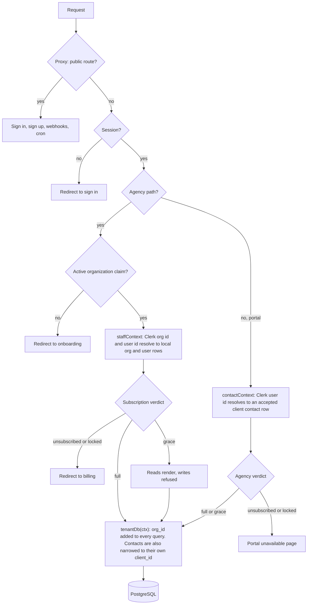
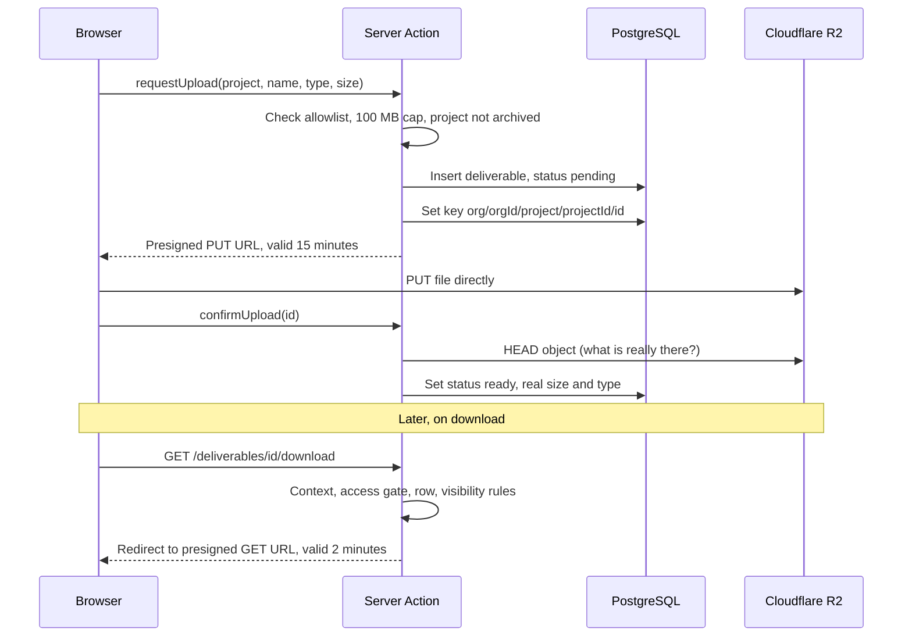

# ClientHQ

A multi tenant portal where agencies run their clients, projects, deliverables and invoices in one place, and each of their clients gets a read only window onto their own work.

## Contents

1. [Executive summary and core invariants](#1-executive-summary-and-core-invariants)
2. [System architecture and boundaries](#2-system-architecture-and-boundaries)
3. [Key architectural decisions and engineering trade offs](#3-key-architectural-decisions-and-engineering-trade-offs)
4. [Technology stack and technical rationale](#4-technology-stack-and-technical-rationale)
5. [Quality assurance, testing and compliance](#5-quality-assurance-testing-and-compliance)
6. [Engineering workflow and standards](#6-engineering-workflow-and-standards)
7. [Local setup and environment provisioning](#7-local-setup-and-environment-provisioning)
8. [Explicit trade offs and roadmap](#8-explicit-trade-offs-and-roadmap)

## 1. Executive summary and core invariants

### Problem statement and solution scope

A small agency usually juggles client records in one tool, files in another, invoices in a third, and status updates in email. Their clients, in turn, keep asking "where is the file?" and "has this been invoiced?".

ClientHQ puts that in one product with two audiences:

- **Agencies** (the paying customer) sign up, create an agency organization, and manage clients, contacts, projects, deliverable files and invoices with their team. Invoices move through a fixed lifecycle and can be rendered as a PDF.
- **Clients** (the agency's customers) are invited by email and get a read only portal showing only their own projects, shared files and invoices.

Agencies pay ClientHQ a monthly subscription through Stripe, with a trial. That is the only money the platform touches.

In scope: sign in and agency organizations, client records, contacts and portal invitations, projects, deliverable upload and download, invoice authoring and lifecycle, invoice PDF, the client portal, team members and roles, provider webhook sync, daily maintenance sweeps.

Out of scope, on purpose: paying an invoice through the platform, agency branding in the portal, a public marketing site, and analytics. See [section 8](#8-explicit-trade-offs-and-roadmap) and the [scope](docs/scope/scope.md) for the full list.

### Non negotiable invariants

These three rules shape every design decision below. If a change would weaken one, it needs its own spec first.

**Zero money transfer.** No client money moves through the platform. Stripe is used for exactly one thing, the agency's own subscription. An invoice is a record the agency sends to its client, and marking it paid is a status change made by staff, not a payment. There is no Stripe Connect, no card form for clients, and nothing to hold in escrow.

**Data isolation.** One agency must never be able to read or write another agency's rows, and a client contact must never see beyond their own client. Every tenant scoped table carries a `NOT NULL` `org_id`, every query goes through one scoping layer that applies it, and a lint rule stops code from reaching around that layer.

**Fail closed security.** When something is unknown, missing or unresolved, the answer is refusal:

- The proxy protects every route except a short public list, so a route nobody has written yet is protected by default.
- A subscription status this build has never heard of locks the agency rather than unlocking it.
- If a request cannot be resolved to a tenant, it is refused. Tenant identity never comes from a URL segment, form field or header.
- A webhook whose signature fails writes nothing at all, and the daily cron route reads and writes nothing without its bearer secret.

One honest limit: the application layer fails closed, but the database layer does not yet. Row level security is deferred (see [section 8](#8-explicit-trade-offs-and-roadmap)), so isolation today is enforced by construction in application code rather than by PostgreSQL itself.

### Where the build stands

Features 1, 2 and 5 (stack, tooling, design system) are done. Features 3, 4 and 6 to 19 are built or in progress, each still moving through its verify, test and review steps. Rate limiting (feature 19) has an approved design in [spec 0018](docs/specs/0018-rate-limiting/index.md) and is not built yet. Product analytics and error tracking (feature 20) still needs a decision. The live status is the table at the top of [docs/scope/scope.md](docs/scope/scope.md).

## 2. System architecture and boundaries

### Dual audience routing

One Next.js App Router application serves both audiences. Route groups (the folders in parentheses) organize the code without changing URLs.

| Audience | Where it lives | URLs | Who gets in |
|---|---|---|---|
| Agency staff | `src/app/(agency)/` | `/dashboard`, `/clients`, `/projects`, `/invoices`, `/team`, `/billing`, `/settings` | A signed in user whose session names an active organization |
| Agency, subscription gated | `src/app/(agency)/(gated)/` | everything above except `/billing` and `/settings` | Also needs a paid up subscription |
| Client contact | `src/app/portal/` | `/portal`, `/portal/projects`, `/portal/invoices`, `/portal/files` | A signed in user with an accepted contact row |
| Signed in, no destination yet | `src/app/(auth)/` | `/sign-in`, `/sign-up`, `/onboarding` | Everyone; `/onboarding` routes a person to their agency, an agency picker, the portal, or a create an agency form |
| Machines | `src/app/api/` | `/api/webhooks/stripe`, `/api/webhooks/clerk`, `/api/cron/daily`, `/api/health/db` | Callers that prove themselves with a signature or a secret instead of a session |

Three details worth knowing:

- `(gated)` is a nested group inside `(agency)`, so URLs stay the same. `/billing` and `/settings` sit outside it on purpose: a lapsed agency must always be able to reach the page that lets it pay, and the redirect to `/billing` can never loop.
- File downloads and invoice PDFs (`/deliverables/[id]/download`, `/invoices/[id]/pdf`, `/portal/invoices/[id]/pdf`) live outside both groups, because both audiences use them. Each handler resolves the caller's context itself and applies the matching access rules.
- The proxy checks the agency paths for an active organization. It deliberately does not check `/portal` or `/onboarding`: a client contact never carries an organization claim, and checking there would bounce them forever.

### Multi tenant isolation flow and context resolution

Every request is resolved to a tenant context once, from a verified session, before any data is touched. The proxy decides from session claims alone (no database call). The layouts and actions then resolve the context against the local mirror rows.



Where the pieces live:

| Step | File |
|---|---|
| Public list and agency path check | [src/proxy.ts](src/proxy.ts) |
| Staff and contact context resolution | [src/db/tenant/context.ts](src/db/tenant/context.ts) |
| Subscription verdict (pure function) | [src/access/level.ts](src/access/level.ts) |
| Portal gate | [src/portal/gate.ts](src/portal/gate.ts) |
| The scoped accessor | [src/db/tenant/accessor.ts](src/db/tenant/accessor.ts) |

## 3. Key architectural decisions and engineering trade offs

Each decision below has a spec with the options considered. This section is the short version.

### Tenant scoped data access layer

The problem: with application enforced tenancy, one query that forgets its `org_id` predicate leaks one agency's data to another, and nothing in the database notices. So the design makes forgetting impossible instead of unlikely.

The layer lives in `src/db/tenant/` and exposes a small surface:

| Name | Role |
|---|---|
| `tenantContext()` | Works out who is asking, once per request, from the session (or the contact row for the portal) |
| `tenantDb(ctx)` | The only way to reach a tenant scoped table. Adds `org_id` to every read, update and delete, and stamps it on every insert |
| `withTenantAction()` | The only shape a Server Action takes |
| `unsafeTenantQuery()` | A conspicuous, logged exit for a query the accessor cannot express. Still scoped, with the predicate written by hand |
| `withSystemAccess()` | The unscoped door, for callers with no tenant to resolve. Fenced to three files |

`withTenantAction()` wraps every write in the same steps:

1. Parse the input with Zod. It is the only parse at this boundary.
2. Resolve the tenant context and check the role (`org:admin` or `org:member`).
3. Check the subscription gate, so a write in the grace window or after a lockout is refused with `subscription_inactive`.
4. Run the handler with a scoped accessor it cannot widen, optionally inside one transaction that rolls back every write if it throws.
5. Return a `Result` with a closed set of error codes, and revalidate declared paths and tags only after success.

Trade offs and how they are contained:

- Coverage is derived from the schema. A table is tenant scoped exactly when it has an `org_id` column, so a new table is protected without anyone remembering to protect it, and a table without one cannot be passed to the accessor at all (a compile error).
- Two ESLint rules make bypassing the layer a build failure: `clienthq/no-raw-db-import` (only `src/db/tenant/**` plus three exact paths may import the raw handle) and `clienthq/no-system-access-import` (only the two webhook routes and the cron route may use the unscoped door). A test fails if the exemption lists drift from spec 0003.
- Staff permissions read the Clerk session claim, not the local `memberships.role` column, which is a display mirror that can be briefly stale.
- Reads are plain statements today. The single choke point exists so that turning on row level security later changes one function and a migration rather than every call site.

Spec: [0003](docs/specs/0003-tenant-scoping-data-access-layer/index.md). Area guide: [src/db/AGENTS.md](src/db/AGENTS.md).

### Direct to storage deliverables pipeline

Deliverable files go straight from the browser to Cloudflare R2, so file bytes never pass through a serverless function. The application only signs short lived URLs and records what happened.



Why it is built this way:

- **A narrow storage port.** [src/storage/port.ts](src/storage/port.ts) has four operations: sign a PUT, sign a GET, read back what exists, delete. Nothing else in the project talks to R2 (an ESLint restriction keeps the AWS SDK out of other files), so an in memory fake in `src/storage/fake.ts` is a complete stand in for every test.
- **Trust the object, not the browser.** The server checks the content type allowlist and size cap before signing, then re reads the stored object with `HEAD` on confirm. A row only becomes `ready` if what landed passes the same rules.
- **Keys carry the tenant.** Object keys are `org/{orgId}/project/{projectId}/{id}`, and the row's id is minted by the accessor, so the key is set in a second step after the insert.
- **Files are private until shared.** `visible_to_client` defaults to false. Downloads redirect to a 2 minute signed URL after the same context and gate checks as any page.
- **No orphans.** A daily sweep removes abandoned `pending` rows, deleting the object first and the row second.
- **Storage is optional outside production.** Without R2 credentials the Deliverables section shows a "storage not configured" notice instead of an upload control.

Trade off: R2's CORS rule is per bucket and per origin, so each preview deployment that needs real uploads needs its own bucket. `pnpm r2:setup` configures a bucket. This is tracked as a deferred decision in the scope.

Spec: [0011](docs/specs/0011-deliverable-upload-download/index.md).

### Idempotent webhook processing ledger

Stripe and Clerk both deliver events at least once, out of order, and sometimes twice at the same moment. The local database mirrors subscription and identity state, so the handlers have to be safe under all of that.

The ledger is the `processed_webhook_events` table: a unique constraint on `(source, event_id)`, no payload (events carry personal data, and both providers keep the originals), pruned after 90 days by the daily cron.

The Stripe handler follows a fixed six step order ([src/payments/webhook.ts](src/payments/webhook.ts)):

1. Verify the signature against the raw body before parsing anything. A failure returns 400 and writes nothing, not even a ledger row.
2. Work out which agency the event belongs to.
3. Re read the subscription from Stripe, outside any transaction. The event says something changed; it is never the source of what it changed to, which is what makes an out of order delivery harmless.
4. Insert the ledger row with `ON CONFLICT DO NOTHING`. If nothing was inserted, the event was already handled: answer 200 and apply nothing.
5. Lock the agency's subscription row `FOR UPDATE`, then apply the retrieved state. This stops two concurrent deliveries from committing in the wrong order.
6. Commit the ledger row and the state change together, or not at all.

Failure policy: almost nothing answers 500. Stripe disables an endpoint that keeps failing, which would silently freeze the subscription mirror. So 500 means only "this might work on retry". An event that can never succeed (naming no agency, or an agency that does not exist) is logged and answered 200. The one exception is a payload that does not parse, which means this code is wrong about Stripe's shapes and deserves the retries and the loud failure.

The Clerk webhook follows the same shape for eight organization, membership and user events, with soft deletes and personal data scrubbing. Both handlers are two of the only three callers allowed to use `withSystemAccess`.

A daily backstop catches what a broken webhook would miss: reconcile sweeps list Stripe subscriptions and Clerk objects and repair any local drift through the same shared apply function.

Specs: [0007](docs/specs/0007-subscription-checkout-and-stripe-webhook/index.md), [0015](docs/specs/0015-clerk-webhook-sync/index.md), [0017](docs/specs/0017-daily-cron-sweeps/index.md).

### Dynamic read time subscription gating

The agency's access level is never stored and never cached. It is computed on every read from two columns of the subscription row and the clock, by a pure function ([src/access/level.ts](src/access/level.ts)).

| Level | Subscription state | Agency experience |
|---|---|---|
| `full` | `trialing` or `active` | Everything works |
| `grace` | `past_due`, less than 7 days since the first failed payment | Reads work under a banner naming the date changes resume; every write is refused |
| `locked` | `past_due` beyond 7 days, `unpaid`, `canceled`, `incomplete_expired`, `paused`, or any status this build does not know | Sent to `/billing` |
| `unsubscribed` | No subscription row, or a Checkout that never finished | Sent to `/billing` |

Why read time instead of a job or a stored flag:

- A grace window expires with no scheduled job and no write. At exactly the boundary the window has closed, and the tests stand on that boundary.
- `cancel_at_period_end` is deliberately not an input. An agency that has cancelled keeps full access until Stripe actually ends the subscription and the webhook records it.
- The status switch is exhaustive. Adding a status to the enum fails the typecheck until it is given a level.
- A `past_due` row with no start date, which the webhook should never produce, is treated as `locked` and reported rather than becoming a grace window with no end.
- Enforcement is in two places. The `(gated)` layout redirects pages, and `withTenantAction()` refuses writes, so a stale page on screen cannot write past the gate.
- The portal reads the same verdict. Clients see everything in `full` and `grace`, and a "portal unavailable" page when the agency is `locked` or `unsubscribed`.

Trade off: a Next.js layout does not re render on a client side navigation, so an agency whose grace window lapses mid session keeps reading until its next full page load. Writes are refused immediately, so the gap is read only and bounded.

Specs: [0007](docs/specs/0007-subscription-checkout-and-stripe-webhook/index.md), [0008](docs/specs/0008-subscription-access-gate/index.md).

## 4. Technology stack and technical rationale

The stack was settled once, in [spec 0001](docs/specs/0001-stack-and-foundational-architecture/index.md), and is the source of truth.

### Core framework and language

| Choice | Why |
|---|---|
| **Next.js 16 App Router, React 19** | Server Components for reads and Server Actions for writes keep data access on the server, next to the tenant layer. One deployable serves both audiences. `src/proxy.ts` is Next 16's name for what used to be middleware |
| **TypeScript 5, strict, on Node 22 LTS** | No `any`, no unchecked casts, and exhaustive switches over the invoice status and subscription status enums, so adding a state is a compile error until every consumer handles it |
| **Tailwind CSS v4 and shadcn/ui** | Accessible primitives built on Radix, themed through design tokens in light and dark. The visual system is written down in [design.md](design.md) |

Next.js 16 has breaking changes from earlier versions. Read the guide in `node_modules/next/dist/docs/` before writing framework code.

### Persistence and ORM

| Choice | Why |
|---|---|
| **PostgreSQL on Supabase** | Real constraints, transactions and row locks, which the invoice numbering and webhook designs rely on |
| **Drizzle ORM** | The schema is TypeScript, migrations are generated SQL committed under `drizzle/` and reviewed in pull requests |
| **drizzle-zod** | Insert and select schemas are derived from the tables, so input parsing and the schema cannot drift. Zod parses every value crossing into the server: Server Action arguments, route bodies, webhook payloads, URL params |

Database rules worth knowing:

- Two connection strings. `DATABASE_URL` is the Supabase transaction mode pooler (port 6543) for every runtime query, with prepared statements off because PgBouncer hands each transaction a different backend. `DIRECT_URL` (port 5432) is for migrations only.
- Money is integer cents with an explicit `char(3)` currency on every invoice. Quantities are `numeric(12,3)` and travel as strings. Rounding is half away from zero, and `CHECK` constraints recompute totals in the database so wrong arithmetic cannot be stored.
- Ids are uuid v7, generated in the application, so they sort by creation time and land at the right edge of the index.
- Delete rules protect history. A client with invoices or projects cannot be deleted, and invoice numbers are unique per agency under concurrent issue.

### Authentication and organization management

**Clerk** provides sign in, sessions and agency organizations. Its roles map to `org:admin` and `org:member`. The application keeps local mirror rows for organizations, users and memberships, synced by the Clerk webhook and repaired on demand if a row is missing, so a person is never stranded between sign up and the webhook arriving.

Client contacts are not Clerk organization members. They are invited by email (through Resend, with React Email templates), accept an invitation, and are then resolved from their accepted `client_contacts` row.

### Payments and storage

- **Stripe** carries the agency subscription only: Checkout, the Billing Portal, and six subscription and invoice events into the webhook. The API version is pinned in code, and the trial length lives on the Stripe Price rather than in this repository. Checkout uses an idempotency key made of agency, customer and a five minute bucket so a double click cannot create two customers.
- **Cloudflare R2** holds deliverable files, reached through presigned URLs and an S3 compatible client behind the storage port described above.

### Document generation

Invoice PDFs are rendered on the server with **`@react-pdf/renderer`**, from the same presentation module the invoice screen uses, so the page and the PDF cannot show different numbers. The agency's own name comes from the database, fonts are bundled, and the same handler serves staff and contacts under their own access rules.

Known limits: A4 only, dates in UTC, money in the `en-US` locale, and no tagged (screen reader navigable) PDF structure. All are tracked in the scope.

### Other providers

| Provider | Role | State |
|---|---|---|
| Resend | Invitation and invoice emails. Without a key in development, emails print to the server console | In use |
| Vercel | Hosting and the daily cron trigger | In use |
| Upstash Redis | Planned for rate limits | [Spec 0018](docs/specs/0018-rate-limiting/index.md) proposes a Postgres counter table instead and retires it |
| Sentry | Errors and traces | Feature 20, needs a decision |

## 5. Quality assurance, testing and compliance

### Testing pyramid

Vitest runs everything under `src/`, `scripts/` and `tools/` (over 200 test files), and tests sit beside the source they cover.

| Layer | What it covers | Examples |
|---|---|---|
| Pure modules | Money, permission and tenancy logic, with the clock as a parameter | `level.test.ts` stands at the grace boundary; `money.test.ts` checks rounding edges; `status.test.ts` covers the invoice lifecycle; `idempotency.test.ts` covers the checkout key |
| Components | Rendered in jsdom with Testing Library, with axe run on the result | `grace-banner.test.tsx`, the primitives and patterns under `src/ui/` |
| Database integration | Claims about PostgreSQL rather than TypeScript, in `*.db.test.ts` files | See the next subsection |
| Browser | Real pages in a real browser | See the Playwright subsection |

Failures are returned as values (a `Result` shape), and the tests assert on those values rather than on thrown errors.

### Multi tenant database boundary tests

The claims that matter most are about SQL, so they are proven against a real PostgreSQL rather than mocks. In CI, a second job starts a throwaway `postgres:17` container (matching the Supabase project's version), applies every migration from empty, applies them again expecting nothing to happen, asserts the live schema against spec 0002, and then runs the `*.db.test.ts` suites against it:

- **Tenancy**: seeds two organizations with overlapping data and asks every accessor method for something it must not reach, including the contact narrowing. It runs inside a transaction that is rolled back, so it can be pointed at a development database safely.
- **Money**: the TypeScript rounding and the `CHECK` constraints agree at the rounding boundaries.
- **Webhooks**: Stripe and Clerk survive replay, reordering, concurrent delivery and rollback. The providers are faked; the transaction is not.
- **Invoices**: two simultaneous issues get consecutive numbers and only one succeeds, and one agency cannot see another's invoices, lines or events.
- **Transactions**: a throw inside a tenant transaction rolls back every write, including the invoice counter.
- **Cron**: every sweep, run isolation, overlap safety, retention cutoffs, and a check that reports and logs carry no personal data.

Locally, these files skip themselves when `DIRECT_URL` is not set, so `pnpm test` works without a database. Point `DIRECT_URL` at a disposable PostgreSQL 17 or a development Supabase project to run them.

### End to end scenarios and journey tests

Playwright specs in `e2e/` run against the real application on port 3100: scaffold and shell, sign in, clients, contacts, projects, deliverables, billing, invoice PDF, and the client portal. The client portal journey needs a second, real signed in session, so it runs its own dev server on port 3101 and only when the `E2E_CLERK_CONTACT_*` variables are present. See [e2e/CLERK.md](e2e/CLERK.md) for how the browser suite gets past sign in with Clerk testing tokens.

### Accessibility

Every UI surface, including empty and error states, must meet WCAG 2.2 AA. It is checked in three ways:

- **Component level**: axe runs in Vitest with the `wcag2a`, `wcag2aa`, `wcag21a`, `wcag21aa` and `wcag22aa` rule sets.
- **In the painted app**: [e2e/axe.ts](e2e/axe.ts) runs the same rules with `@axe-core/playwright` in both light and dark themes, which is where contrast as actually painted and target size as actually laid out can be seen.
- **Tokens**: a contrast test enforces the colour token pairs in both themes, and dedicated specs cover zoom and reduced motion.

Automated tools do not replace a person with a keyboard and a screen reader, so a manual pass is part of `/check verify`. The `/design` route shows every component in every state in both themes.

### Static guardrails

- `clienthq/no-raw-db-import` blocks importing `src/db/client.ts` outside the data access layer.
- `clienthq/no-system-access-import` blocks the unscoped door outside the two webhook routes and the cron route.
- `tenant-isolation-config.test.mts` fails if either exemption list stops matching spec 0003, so widening one is a pull request conversation, not a quiet edit.
- A `no-restricted-imports` rule keeps the AWS SDK inside the storage port.
- Every commit runs `.githooks/pre-commit` (format and lint on staged files, typecheck of the whole project). CI runs format, lint, typecheck, unit tests and a migration drift check on every push and pull request. `.github/workflows/migrate.yml` migrates the deployed database on merge to `main` and only then triggers the deploy, so a failed migration stops the release.

## 6. Engineering workflow and standards

### Tracer bullet approach

The build proves the whole pipe before building any part of it fully. Slice 1 is a walking skeleton: real auth, real database, real tenancy, real UI, really deployed, and narrow rather than fake. It ends with the first tenant scoped write and read (client records). Later slices widen the pipe one feature at a time: subscription, contacts, projects, deliverables, invoices, portal, team, maintenance.

### Spec driven development lifecycle

Each feature moves through the same skills, and each step leaves an artifact behind.

| Step | Skill | Leaves behind |
|---|---|---|
| Plan the roadmap | `/scope` | [docs/scope/scope.md](docs/scope/scope.md), the living feature list with status |
| Decide and design | `/architect` | `docs/specs/NNNN-title/index.md` with acceptance criteria (`AC-1`, `AC-2`, and so on) and `rationale.md` with the options considered |
| Build | `/develop` | Code in small vertical threads, each mapped to acceptance criteria in the spec's build plan |
| Prove behaviour | `/check verify` | `verify.md` beside the spec, from driving the real app against every acceptance criterion |
| Write tests | `/test` | `*.test.ts` files beside the source |
| Independent review | `/check review` | A file in `docs/reviews/`, written by a model that did not write the code |
| Write it up | `/document` | PR text, changelog entries, release notes |
| Keep context current | `/sync` | Updated `AGENTS.md` files and scope reconciliation |

`/audit` bootstraps the `AGENTS.md` files every later step reads, and `/debug` finds root causes without adding features. Test files carry a `covers: spec NNNN AC-N` header so a criterion can be traced to its proof.

Conventions: functional and immutable code, pure functions by default with side effects pushed to the edges, named exports, every environment variable declared in the Zod schema in `src/lib/env.ts` and read through `env()`, `snake_case` in SQL and `camelCase` in TypeScript, and Conventional Commits. The full list is in [AGENTS.md](AGENTS.md).

## 7. Local setup and environment provisioning

### Prerequisites and tooling

| You need | Notes |
|---|---|
| Node 22 or newer | The `engines` field enforces it |
| pnpm 11 | Use `corepack pnpm` if `pnpm` is not on your path, or run `corepack enable pnpm` once |
| A PostgreSQL 17 database | A Supabase project matches production. You need both the pooler and the direct connection strings |
| A Clerk application | A development instance, with organizations enabled |
| A Stripe account in test mode | A product with a monthly recurring Price and a 14 day trial set on it. The [Stripe CLI](https://docs.stripe.com/stripe-cli) for local webhooks |
| Optional: Cloudflare R2 and Resend | Without them, uploads show a notice and emails print to the console |

Stripe dashboard prerequisites (Billing Portal setup and the six webhook events) are listed in the comments of [.env.example](.env.example). The Clerk webhook needs eight events, listed there too.

### Environment variables reference

```bash
corepack pnpm install
cp .env.example .env.local   # then fill in the values
```

`.env` also works. `.env.local` takes precedence, and the migration tooling and scripts follow the same order as Next. Every variable is validated in [src/lib/env.ts](src/lib/env.ts), and a missing one fails with a named message.

| Variable | Required | Purpose |
|---|---|---|
| `DATABASE_URL` | Yes | Supabase transaction mode pooler, port 6543. Every runtime query |
| `DIRECT_URL` | Yes | Direct connection, port 5432. Migrations and the database tests only |
| `NEXT_PUBLIC_APP_URL` | Defaults to `http://localhost:3000` | Base URL for Stripe redirects and email links |
| `NEXT_PUBLIC_CLERK_PUBLISHABLE_KEY`, `CLERK_SECRET_KEY` | Yes | Clerk keys |
| `NEXT_PUBLIC_CLERK_SIGN_IN_URL`, `NEXT_PUBLIC_CLERK_SIGN_UP_URL` | Yes | Must agree with the routes under `src/app/(auth)` (`/sign-in`, `/sign-up`) |
| `NEXT_PUBLIC_CLERK_SIGN_IN_FALLBACK_REDIRECT_URL`, `NEXT_PUBLIC_CLERK_SIGN_UP_FALLBACK_REDIRECT_URL` | Yes | Both point at `/onboarding` |
| `CLERK_WEBHOOK_SIGNING_SECRET` | Yes | Verifies the Clerk webhook |
| `NEXT_PUBLIC_STRIPE_PUBLISHABLE_KEY`, `STRIPE_SECRET_KEY` | Yes | Stripe keys |
| `STRIPE_WEBHOOK_SECRET` | Yes | Locally, use the `whsec_` that `stripe listen` prints |
| `STRIPE_PRICE_ID` | Yes | The monthly Price. The trial length is set on the Price in Stripe |
| `EMAIL_FROM` | Yes | Bare sending address on a domain verified in Resend |
| `CRON_SECRET` | Yes | Bearer token for `/api/cron/daily`, at least 16 characters. Generate with `openssl rand -hex 32` |
| `RESEND_API_KEY` | Production | Without it in development, emails print to the console |
| `R2_ACCOUNT_ID`, `R2_ACCESS_KEY_ID`, `R2_SECRET_ACCESS_KEY`, `R2_BUCKET` | Production | Without them, uploads show a "storage not configured" notice |
| `R2_ADMIN_ACCESS_KEY_ID`, `R2_ADMIN_SECRET_ACCESS_KEY` | Only for `pnpm r2:setup` | An admin token used to configure the bucket. Never set on Vercel |
| `SEED_ALLOW_HOST` | Development only | A non local database host that `pnpm db:seed` may write to |
| `E2E_CLERK_USER_*`, `E2E_CLERK_CONTACT_*` | Optional | Dedicated Clerk development users for the browser suite. Tests that need them skip when unset |

### Database migrations, schema assertions and seed scripts

| Command | What it does |
|---|---|
| `pnpm db:check` | One round trip to Postgres through Drizzle. Writes nothing. The running app has the same check at `/api/health/db` |
| `pnpm db:generate` | Generate a migration from `src/db/schema/`. Never hand edit generated SQL |
| `pnpm db:migrate` | Apply migrations over `DIRECT_URL` |
| `pnpm db:migrate:check` | Fail if the schema and the committed migrations have drifted apart |
| `pnpm db:schema:assert` | Read the live PostgreSQL catalogue and compare tables, constraints, indexes and delete actions with spec 0002 |
| `pnpm db:seed` | A repeatable development seed: an agency with staff, clients, contacts, projects, deliverables and invoices in every status. Running it again updates rather than duplicates |
| `pnpm db:studio` | Drizzle Studio |
| `pnpm r2:setup` | Configure the R2 bucket's CORS rule |

The seed refuses to open a connection unless the `DIRECT_URL` host is `localhost` or the host named in `SEED_ALLOW_HOST`, so a production string in the wrong terminal changes nothing.

Then start the app:

```bash
corepack pnpm db:migrate
corepack pnpm dev
```

It serves on http://localhost:3000. For Stripe and Clerk events locally, forward them to the app with `stripe listen --forward-to localhost:3000/api/webhooks/stripe` and the Clerk CLI relay described in `.env.example`. To trigger the daily sweeps by hand:

```bash
curl -i -H "Authorization: Bearer $CRON_SECRET" http://localhost:3000/api/cron/daily
```

The Supabase free tier pauses a project after about a week without traffic. The daily cron route's own queries keep it awake.

### Running the verification suite

```bash
corepack pnpm format:check      # Prettier
corepack pnpm lint              # ESLint, including the two tenant isolation rules
corepack pnpm typecheck         # next typegen, then tsc
corepack pnpm test              # Vitest; database suites skip without DIRECT_URL
corepack pnpm db:migrate:check  # schema and migrations still agree
corepack pnpm test:e2e          # Playwright, against the dev server on port 3100
```

To include the database suites, set `DIRECT_URL` to a migrated PostgreSQL and run them by file, for example:

```bash
corepack pnpm vitest run src/db/tenant/tenancy.db.test.ts
```

`pnpm install` points `core.hooksPath` at `.githooks/`, so the pre commit checks run on their own. `git commit --no-verify` skips them, and CI runs the same checks either way.

## 8. Explicit trade offs and roadmap

These are decisions made on purpose and deferred, each with a reason and a trigger. They are recorded here so the plan stays honest.

### Database level row level security staging

Today, tenant isolation is enforced in application code, and the database will hand over any row it is asked for. Row level security would fail closed at the database instead, and it is the single biggest security upgrade available to this design.

It was deferred because of serverless connection pooling, not because it is unwanted. The transaction mode pooler gives every transaction a different backend connection, so a per request setting has to be applied inside each transaction.

The design is already unblocked: `org_id` is `NOT NULL` on every tenant table, and all access goes through one choke point.

- **Trigger:** decide before a second real agency's data lives in the database. Not a date, and not launch, but the first moment two tenants share the tables.
- **The work:** a dedicated application database role that does not bypass policies, a policy migration across the eight tenant tables (of shape `org_id = current_setting('app.current_org_id')::uuid`), and changing the layer's single choke point to open a transaction and set the setting.

### Timezone handling and localization

No timezone is modelled anywhere. `issue_date` and the overdue sweep use the UTC calendar day, and billing, grace and invitation dates are rendered in UTC with an explicit label. The effect: an invoice issued at 23:00 in Los Angeles gets tomorrow's date.

The schema is shaped for the fix. Dates are `date` columns supplied by the application rather than by SQL `current_date`, and the UTC day comes from one helper.

- **Plan:** add `organizations.timezone` and a helper that returns the agency's calendar day, then use it for issue dates, the overdue sweep, and the project overdue badge (which already takes "today" as a parameter).
- **Related, deferred with it:** agency locale and letterhead. The PDF uses A4 and `en-US` money formatting because `organizations` has no address, tax id, page size or locale columns.

### Non decimal currency support

The invoice unit amount input and the money formatter assume two minor unit digits, which is right for USD, EUR and GBP. Every invoice carries its own `char(3)` currency, and the database constrains its format (three uppercase letters) rather than the ISO 4217 list, which would go stale inside a migration. A currency with zero or three minor units, such as JPY or KWD, would be entered and displayed inconsistently.

- **Plan:** a minor unit table keyed by currency, used by input parsing and formatting, decided before an agency outside the two decimal world signs up.

### Also deferred

- Rate limits on uploads, invoice emails and agency creation: designed in [spec 0018](docs/specs/0018-rate-limiting/index.md), not built.
- Error tracking and product analytics: needs a decision.
- Purging a deleted agency (cancelling its Stripe subscription, then removing its rows and R2 objects after a grace period): destroys data, so it gets its own decision.
- A queryable audit history, agency settings page, agency branding in the portal, a tagged (accessible) invoice PDF, and a staff preview of the portal.

Each is tracked with its origin in the Deferred section of [docs/scope/scope.md](docs/scope/scope.md).

## Further reading

- [docs/scope/scope.md](docs/scope/scope.md): the feature roadmap and live status
- [docs/specs/](docs/specs/): one folder per decision, with acceptance criteria and rationale
- [AGENTS.md](AGENTS.md) and [src/db/AGENTS.md](src/db/AGENTS.md): conventions and the tenant rule
- [design.md](design.md): the design system
- [CHANGELOG.md](CHANGELOG.md): what has changed
